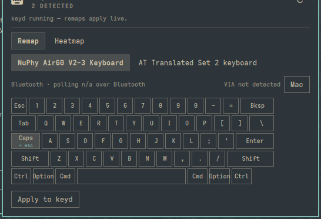
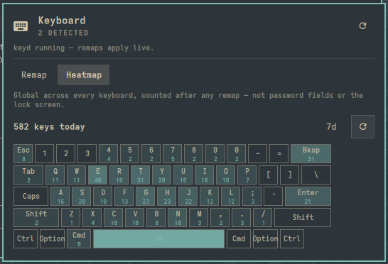

# Omakeys

A per-device keyboard customizer for [Omarchy](https://omarchy.org) Quattro:
universal remapping via [keyd](https://github.com/rvaiya/keyd), VIA/QMK
detection when your board supports it, and a keypress heatmap — all themed
to match your shell, because it reads colors from Omarchy's own `Color`/
`Style` singletons instead of hardcoding any.

<p align="center">
  
  &nbsp;&nbsp;
  
</p>

## Features

- **Universal remapping** — click any key on a live keyboard grid, pick a
  target from a searchable list of every key `keyd` knows, apply with one
  authentication prompt. Works on any keyboard, not just VIA/QMK boards.
- **Per-device detection** — auto-discovers every connected keyboard via
  udev, shows connection type (USB/Bluetooth/built-in) and polling rate
  where the kernel exposes it.
- **VIA/QMK aware** — detects boards that speak the VIA raw-HID protocol,
  for when you want to reach for VIA/Vial directly instead.
- **Keypress heatmap** — a lightweight background counter turns your actual
  typing into a themed heatmap on the same key grid, aggregate counts only.
- **Zero hardcoded colors** — every surface comes from the shell's own
  theme tokens, so it reskins instantly with the rest of Omarchy in both
  light and dark themes.

## Requirements

- [Omarchy](https://omarchy.org) Quattro (the Quickshell-based shell).
- [`keyd`](https://github.com/rvaiya/keyd) for remapping:
  `sudo pacman -S keyd` (a real terminal — `sudo` needs a TTY).

## Install

```bash
omarchy plugin add https://github.com/akashpai11/omakeys.git --enable
```

## Removal

```bash
omarchy plugin remove akashpai11.omakeys
```

This removes the plugin folder and its bar entry. It does **not** touch
anything the one-time setup step granted, since those are normal system
state outside the plugin's own directory, not plugin data:

- `keyd` itself, and any per-device configs it wrote under `/etc/keyd/`
  (delete manually if you no longer want the remaps, or `sudo pacman -R keyd`
  to remove keyd entirely).
- The `keyd`/`input` group membership added by **Grant access**
  (`sudo gpasswd -d $USER keyd && sudo gpasswd -d $USER input`, then log
  out and back in).
- The udev rule at `/etc/udev/rules.d/70-omakeys-via.rules`
  (`sudo rm /etc/udev/rules.d/70-omakeys-via.rules && sudo udevadm control --reload-rules`).
- Its own data at `~/.config/omarchy/omakeys/` (remap profiles, heatmap
  database) — `rm -rf ~/.config/omarchy/omakeys` if you want it gone too.

## One-time setup

Two things need a privileged step the first time, both handled from inside
the panel:

1. **Remapping** just works once `keyd` is installed — the plugin enables
   the service and writes its config itself, one `pkexec` prompt per apply.
2. **VIA detection and the heatmap** need this account in the `keyd`/`input`
   groups and a udev rule for raw-HID access. The panel shows a **Grant
   access** button the moment it notices either is missing — one `pkexec`
   prompt does both. The udev rule takes effect immediately; group
   membership needs a logout/login first (a Linux session thing, not a bug
   — you'll see a note in the panel until then).

## Privacy

The heatmap counts keycodes only — never sequences, never timestamps
precise enough to reconstruct typing — and stops while the session is
locked. It's necessarily global across every keyboard and counts the
*post-remap* key: once `keyd` is running it merges every physical keyboard
into one virtual output device, so per-device and pre-remap attribution
isn't recoverable downstream of it.

## Known limitations

- VIA detection is verified to correctly report "not detected" over
  Bluetooth on real hardware; a true positive (a VIA board actually
  detected) hasn't been verified yet — most boards only expose the VIA
  raw-HID interface over USB, not Bluetooth.
- Polling-rate readout is implemented via the USB `bInterval` sysfs walk
  but unverified against real wired hardware so far.
- No RGB/macro control, suggestion engine, or per-app layer switching yet.

## Dev loop

This repo has to live directly under `~/.config/omarchy/plugins/omakeys/`
(a real directory, not a symlink) — the shell's recursive `inotifywait`
watcher won't see edits inside a symlinked plugin folder.

```bash
omarchy plugin validate ~/.config/omarchy/plugins/omakeys
omarchy plugin enable akashpai11.omakeys --section right
```

Most QML/script edits hot-reload live. Changes to `PanelWindow`-level
geometry (contentWidth/contentHeight) don't reliably apply via hot-reload —
run `omarchy restart shell` after those before judging the result.

```bash
omarchy-shell akashpai11.omakeys toggle   # open/close the panel
python3 scripts/detect_devices.py | python3 -m json.tool
python3 scripts/heatmap_query.py 1 | python3 -m json.tool
```

## License

MIT — see [LICENSE](LICENSE).
